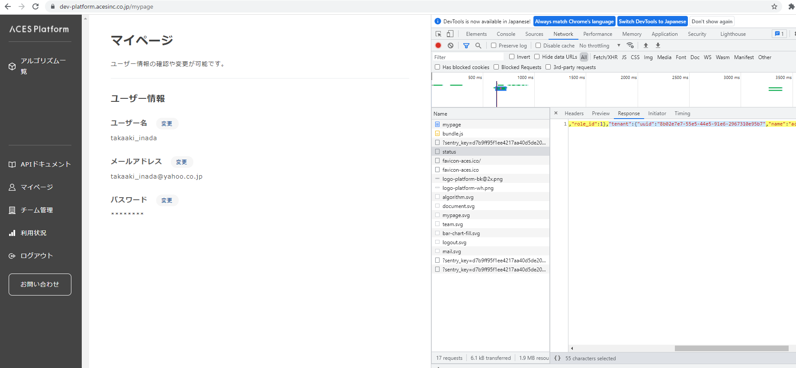

# 推論アルゴリズムサーバのデプロイ  <!-- omit in toc -->

## 目次  <!-- omit in toc -->
- [1. デプロイ前の各種設定](#1-デプロイ前の各種設定)
  - [1.1. デモサイトとAPIの設定](#11-デモサイトとapiの設定)
  - [1.2. 重みファイルのアップロード](#12-重みファイルのアップロード)
- [2. 初回デプロイ設定](#2-初回デプロイ設定)
  - [2.1. アルゴリズムサーバのインスタンスサイズの設定](#21-アルゴリズムサーバのインスタンスサイズの設定)
  - [2.2. github actions workflowの設定](#22-github-actions-workflowの設定)
  - [2.3. 初回デプロイ](#23-初回デプロイ)
  - [2.4. デプロイ結果の確認](#24-デプロイ結果の確認)
  - [2.5. 動作確認](#25-動作確認)

## 1. デプロイ前の各種設定

### 1.1. デモサイトとAPIの設定


ACES Platform UI画面に表示されるアルゴリズムの情報を編集・登録します。

- イメージ画像
- タイトル ( 例 : `Object Detection` )
- サブタイトル ( 例 : `物体検出` )
- 説明文
- アルゴリズムの種類

が必要です。

`server/algorithms/register.json`
この定義ファイルに記載されたリポジトリの情報がデプロイでACES Platformに自動登録されます。
`name`, `title`, `subtitle`, `context`, `image_key` を修正します。
特に`name`は[algorithm.json](server/algorithms/algorithm.json)で登録したアルゴリズムとACES Platformの紐付けで使われるため、[algorithm.json](server/algorithms/algorithm.json)の`task_name`と同じにします。
```json:server/algorithms/register.json
{
    "plan_id": 1,
    "overflow_mode": 1,
    "services": [
        {
            "name": "algorithm",
            "title": "Number Plate Detection",
            "subtitle": "ナンバープレート検出",
            "content": "画像から車のパーツの種類と位置を高速かつ高精度に検出。",
            "type": "simple",
            "unit_name": "frame",
            "point_per_frame": 0,
            "results_to_show_default": false,
            "image_key": "example_algorithm.png",
            "algorithms": ["NA"]
        }
    ]
}
```

アルゴリズムの種類(`type`)がfileの場合は、登録するアルゴリズムが処理するファイルの種類として`input_mimes`と`output_mimes`の登録が必要です。
```json:server/algorithms/register.json
{
    "plan_id": 1,
    "overflow_mode": 1,
    "services": [
        {
            "name": "algorithm",
            "title": "Number Plate Detection",
            "subtitle": "ナンバープレート検出",
            "content": "画像から車のパーツの種類と位置を高速かつ高精度に検出。",
            "type": "file",
            "input_mimes": ["application/zip"],
            "output_mimes": ["application/json"],
            "unit_name": "second",
            "point_per_frame": 0,
            "results_to_show_default": false,
            "image_key": "example_algorithm.png",
            "algorithms": ["NA"]
        }
    ]
}
```


それぞれカラムの説明は以下の通り

| カラム | 説明 |
| --- | --- |
| `name` | エンドポイント用の `task_name` (30文字以内で小文字) |
| `title` | 一覧表示用のアルゴリズム英語名 (60byte以内) |
| `subtitle` | 一覧表示用のアルゴリズム日本語名 (30byte以内) |
| `content` | 一覧表示用のアルゴリズム説明文 (255byte以内) |
| `type` | アルゴリズムのタイプ ( `'simple'` or `'image'` or `'file'` ) |
| `input_mimes` | アルゴリズムの種類(`type`)がfileの場合に設定。受け付けるファイルの種類。複数のファイル入力の場合は複数記述する。１ファイルでも配列で記述。 |
| `output_mimes` | アルゴリズムの種類(`type`)がfileの場合に設定。処理結果のファイルの種類。複数のファイルとして結果を返す場合は複数記述する。１ファイルでも配列で記述。 |
| `unit_name` | 利用状況画面で表示するアルゴリズム推論数の単位名 |
| `point_per_frame` | 画像 1 枚を推論するために必要なクレジット(現状未使用) |
| `results_to_show_default` | 推論結果として静止画イメージを作成しない場合はAPIリクエストの応答速度を短くするため false をセットする |
| `image_key` | 一覧表示用の画像のファイル名 |
| `algorithms` | アルゴリズムのモデル名のリスト(現状未使用) |

- `name` はタスクの名前。[API エンドポイントに使用する task_name の決定](https://aces.kibe.la/notes/15646#121-api-%E3%82%A8%E3%83%B3%E3%83%89%E3%83%9D%E3%82%A4%E3%83%B3%E3%83%88%E3%81%AB%E4%BD%BF%E7%94%A8%E3%81%99%E3%82%8B-task_name-%E3%81%AE%E6%B1%BA%E5%AE%9A)で決めた task_name と同じにする。この名前がURLに反映される。
- `type` はアルゴリズムの種類に応じて入力します。`'simple'` か `'image'` か `'file'` の値しか取らず、通常のアルゴリズムは `'simple'` 、推論で画像しか返さないアルゴリズムは `'image'` とします。画像以外は `'file'` にします。
- `point_per_frame` は課金額のための設定(未使用で何か設定しておけば良い)
- `algorithms` はモデル名のリスト。最初の値がデフォルトで使用されます（未使用で何か設定しておけば良い）

Frontに表示されるアルゴリズムのイメージファイルを差し替えます
`server/algorithms/example_algorithm.png`

PrivateAlgorithmはテナントのプランが business プラン(plan_id=1)である必要があります
後述するアルゴリズムサーバのデプロイ(github actionsのworkflowの実行)で`server/algorithms/register.json`の情報が自動登録され business プラン(plan_id=1) になります


### 1.2. 重みファイルのアップロード

アルゴリズムの推論で使用するモデルの重みファイルをtar.gz形式で作成しS3の所定の場所にアップロードします。
ファイル名は`deploy.tar.gz`とします。

ローカルマシンの以下のファイルパスに重みがダウンロードされている場合の重みファイルの作成の例を書きます。

```
/home/ubuntu/temp/root/datadrive/ObjectDetection/models/CenterNet_coco_finetune_car-parts-aldila-1110_acesvision-v2/CenterNet.yml
/home/ubuntu/temp/root/datadrive/ObjectDetection/models/CenterNet_coco_finetune_car-parts-aldila-1110_acesvision-v2/label.txt
/home/ubuntu/temp/root/datadrive/ObjectDetection/models/CenterNet_coco_finetune_car-parts-aldila-1110_acesvision-v2/checkpoints/CenterNet.pth
```

重みファイルを作成するコマンド
```
cd /home/ubunt/temp/root/datadrive
tar cvfz deploy.tar.gz ObjectDetection/models/CenterNet_coco_finetune_car-parts-aldila-1110_acesvision-v2
```
複数モデルがある場合
```
tar cvfz deploy.tar.gz ObjectDetection/models/CenterNet_coco_finetune_car-parts-aldila-1110_acesvision-v2 FaceAlignment2D/models/Fan2D_300W_masked_60089f4d
```
※ シンボリックリンクファイルや隠しファイル等不要なファイルは含めません。不必要なファイルを含むとsagemakerのデプロイでエラーになる場合があります。なるべくファイルパスを絞ってtar.gzファイルを作成します。

ファイルの中身の確認例
tar tvfz deploy.tar.gz
```
drwxrwxrwx test/test         0 2021-11-02 00:44 ObjectDetection/models/CenterNet_coco_finetune_car-parts-aldila-1110_acesvision-v2/
-rwxrwxrwx test/test      2785 2021-04-20 17:11 ObjectDetection/models/CenterNet_coco_finetune_car-parts-aldila-1110_acesvision-v2/CenterNet.yml
drwxrwxrwx test/test         0 2021-11-02 00:44 ObjectDetection/models/CenterNet_coco_finetune_car-parts-aldila-1110_acesvision-v2/checkpoints/
-rwxrwxrwx test/test 2296054794 2021-04-20 17:11 ObjectDetection/models/CenterNet_coco_finetune_car-parts-aldila-1110_acesvision-v2/checkpoints/CenterNet.pth
-rwxrwxrwx test/test        847 2021-04-20 17:11 ObjectDetection/models/CenterNet_coco_finetune_car-parts-aldila-1110_acesvision-v2/label.txt
```

不必要なファイルを含んでいた場合にAWSコンソールのsagemakerのendpoint画面にデプロイ時に出るエラーメッセージ
```
Failed to extract model data archive for container "container_1" from URL "s3://project-template-example-dev/shared/weights/deploy.tar.gz". Please ensure that the object located at the URL is a valid tar.gz archive.
```

重みファイルが出来たら、S3にアップロードします。
アップロード先は `s3://${Project}-${Env}/shared/weights/` です。

```
aws s3 cp deploy.tar.gz s3://${Project}-${Env}/shared/weights/
```

重みファイルを更新したらアップロードしなおしてください。後述するアルゴリズムサーバのデプロイ(github actionsのworkflowの実行)で反映されます。

## 2. 初回デプロイ設定
サーバデプロイ時最初に一回だけ行う設定

### 2.1. サーバの設定

- アルゴリズムサーバのインスタンスサイズの設定

server/infra/configs/${Project}-${Env}-algorithm-server-infra.yml
```
SAGEMAKER_INSTANCE_TYPE: 'ml.t2.xlarge'
aws_batch_instance_type: m5.xlarge
aws_longtime_batch_instance_type: m5.xlarge
```
defaultはCPUサーバでのデプロイ設定になっていますので、GPUサーバを使う場合は`ml.g4dn.xlarge`等適切なインスタンスタイプに変更します。

- 非同期APIを使用する場合のAWSサービス選択

server/infra/configs/${Project}-${Env}-algorithm-server-infra.yml
```
# 非同期APIで実行するAWSコンポーネント ['sagemaker', 'aws_batch'] (省略すると'aws_batch')
ASYNC_COMPONENT_SERVICE: aws_batch
```
|        | 同期API   | 非同期API   | 制約     |
|:-------|:-------|:-------|:---------|
| sagemaker       | 〇       | 〇        | ファイル(payload)6MB, 推論時間1分まで         |
| sagemaker async       | 対応しない *1      | 〇     | ファイル6MB or 1GB(*2), 推論時間15分まで         |
| AWS Batch       | 対応しない      | 〇     | 制約なし(コンテナ起動時間が必要)         |

sagemaker asyncとAWS Batchの違い
- AWS Batchはコンテナ起動時間が必要なのに対して、sagemaker asyncはコンテナ起動時間が不要となるためその分sagemaker asyncが早い
- sagemaker asyncはインスタンス常時稼働なので、使っていない時もコストがかかる (同時にリクエストがきた場合は待つか、サーバをスケールするか選べる。サーバをスケールする場合でもインスタンス起動時間分レスポンスタイムが遅くなる)

*1: サーバをsagemaker asyncを選択して起動した場合は、同期APIのリクエストがきたらnot supportで返す
*2: ACES Platformに直接APIでファイルをアップロードする場合は6MBまで。一旦uploadurlを発行してuploadurlにファイルアップロードする場合は1GBまで

### 2.2. github actions workflowの設定

.github/workflows/build_on_push_develop.yml
```yaml
    env:
      ENV: <REPLACE_YOUR_ENV>
      Project: <REPLACE_YOUR_PROJECT_NAME>
      DEPLOY_TAG: deploy
      AWS_ROLE_ARN: arn:aws:iam::<REPLACE_YOUR_AWS_ACOUNT_ID>:role/<REPLACE_YOUR_PROJECT_NAME>-<REPLACE_YOUR_ENV>-github-actions-role
      TENANT_ID: <REPLACE_YOUR_TENANT_ID>
      FRONTEND_IMAGE_PATH: server/algorithms/example_algorithm.png  # ACES Platformのデモ画面に表示するイメージ画像
```
環境設定を各Projectにあわせて置き換えます。

- <REPLACE_YOUR_ENV>: dev, staging, production
  - production: 正式に顧客にAPI提供する環境
  - dev: 社内開発時はdev環境を使用します
  - staging: productionへリリースする前の確認環境(大規模開発でversion管理が必要になったり、QAテスト等を必要としない限り考慮しなくてよい環境です)
- <REPLACE_YOUR_PROJECT_NAME>: Project名(必ず${Project}と同じ値を設定します)
- <REPLACE_YOUR_AWS_ACCOUNT_ID>: デプロイするAWSアカウントのID `server/infra/configs`の設定ファイルの`account_id`の値(dev環境のAWSアカウントのIDは`566399633171`)
- <REPLACE_YOUR_TENANT_ID>: ACES Platformでアルゴリズムを公開するユーザグループのTENANT_ID(調べ方は以下2通り。dev環境のACESテナントのIDは`46ff6ce6-889f-440d-b63a-79af35b5b537`)

`FRONTEND_IMAGE_PATH`で設定したパスにACES Platformのデモ画面に表示するイメージ画像を設定できます。必要に応じて画像を配置しパスを修正します。
なお、開発環境は22:00で自動停止します。以下の方法で応答が返ってこない場合は[ACES Platformのdev環境のサービスを起動する](https://aces.kibe.la/notes/15646#q5-aces-platform%E3%81%AEdev%E7%92%B0%E5%A2%83%E3%81%AE%E3%82%B5%E3%83%BC%E3%83%93%E3%82%B9%E3%82%92%E8%B5%B7%E5%8B%95%E3%81%99%E3%82%8B)の手順で開発環境を起動します。

**ACES Platformのデモ画面からの確認方法**
ACES Platformの管理者に自分のユーザを管理者権限にしてもらってから実行します。
ブラウザでACES PlatformにログインしてF12キーでDeveloper Consoleを開き、ACES Platformのサイドメニューの「チーム管理」をクリックした時にACES Platformのstatus APIのresponseで返ってくるtenant UUID
  - 開発環境: https://dev-platform.acesinc.co.jp
  - 本番環境: https://platform.acesinc.co.jp
```
{"user":{"id":1,"email":"xxx@acesinc.co.jp","full_name":"xxx","role_id":1},"tenant":{"uuid":"af17ca40-c2a8-4657-b4cd-63bf93967f2b","name":"xxx","department":"xxx","plan_id":0}}
```


**コマンドでの確認方法**
```
curl --location --request POST '<API_ENDPOINT>/accounts/login/' \
--header 'Content-Type: application/json' \
--data-raw '{"email":"{your_email_address}@acesinc.co.jp","password":"{your_password}"}'
```
- <API_ENDPOINT>
  - 開発環境: https://api-dev-platform.acesinc.co.jp
  - 本番環境: https://api-platform.acesinc.co.jp

レスポンス
```
{
    "id": 89,
    "token": "f7d6ff820a3ed72fa2fcea2a8d91fc53bf6a5566168f106bd0311effbd720ad5",
    "token_key": "f7d6ff82",
    "expiry": "2021-11-22T21:14:09.256104+09:00"
}
```
レスポンスのtokenをメモします。

```
curl --location --request GET 'https://{api_endpoint}/accounts/status'
--header 'Authorization: Token {一つ上のコマンドで取得したtokenをセット}'
```

レスポンスでtenant.uuidが返ってきます。
```
{
    ...
    "tenant": {
        "uuid": "8b02e7e7-55e5-44e5-91e6-2967310e95b7",
        "name": "aces",
        "department": "aces",
        "plan_id": 1
    }
}
```

.github/workflows/build_on_push_develop.yml
```yaml
  # push:
  #   branches:
  #     - 'develop'
```
ファイル先頭のこのコメントアウトを解除することで、developマージ&pushでgithub actionsのワークフローが実行され自動的にAWSにアルゴリズムサーバがデプロイされます

### 2.3. 初回デプロイ

一度developに修正をcommitして、githubのUI上でgithub actionsが実行されデプロイが完了するのを確認します。

なお、開発環境は22:00で自動停止しています。[ACES Platformのdev環境のサービスを起動する](https://aces.kibe.la/notes/15646#q5-aces-platform%E3%81%AEdev%E7%92%B0%E5%A2%83%E3%81%AE%E3%82%B5%E3%83%BC%E3%83%93%E3%82%B9%E3%82%92%E8%B5%B7%E5%8B%95%E3%81%99%E3%82%8B)の手順で事前に開発環境を起動してからデプロイします。
開発環境が停止している場合github actionsで以下のエラーが発生します。
```
requests.exceptions.ConnectionError: HTTPConnectionPool(host='api-dev.aces-platform-dev.internal', port=80): Max retries exceeded with url: /internal/tenants/7fc951fe-8ad7-441f-9242-408b7d2cdb65/services (Caused by NewConnectionError('<urllib3.connection.HTTPConnection object at 0x7f958abdc3d0>: Failed to establish a new connection: [Errno -2] Name or service not known'))

```

この手順でAWS上にアルゴリズムサーバが起動するので、アルゴリズムサーバの常時起動が必要なければ、手順 [4.2. アルゴリズムサーバを使い終わったら停止する](https://aces.kibe.la/notes/15646#42-%E3%82%A2%E3%83%AB%E3%82%B4%E3%83%AA%E3%82%BA%E3%83%A0%E3%82%B5%E3%83%BC%E3%83%90%E3%81%AE%E4%BD%BF%E7%94%A8%E5%BE%8C%E3%81%AE%E5%81%9C%E6%AD%A2) を実行して手動でアルゴリズムサーバを停止します。

### 2.4. デプロイ結果の確認
github actionsのワークフローの実行ログを確認して途中でエラーでとまっていないことを確認します。

正常に動作しない時はFAQのトラブルシューティングを行います。
[github actionsのデプロイワークフローでsagemakerのデプロイでSessionタイムアウトエラーになった](https://aces.kibe.la/notes/15646#q2-github-actions%E3%81%AE%E3%83%87%E3%83%97%E3%83%AD%E3%82%A4%E3%83%AF%E3%83%BC%E3%82%AF%E3%83%95%E3%83%AD%E3%83%BC%E3%81%A7sagemaker%E3%81%AE%E3%83%87%E3%83%97%E3%83%AD%E3%82%A4%E3%81%A7session%E3%82%BF%E3%82%A4%E3%83%A0%E3%82%A2%E3%82%A6%E3%83%88%E3%82%A8%E3%83%A9%E3%83%BC%E3%81%AB%E3%81%AA%E3%81%A3%E3%81%9F)

### 2.5. 動作確認
ACES PlatformからAlgorithmの動作確認([3. アルゴリズムサーバの動作確認](https://aces.kibe.la/notes/15646#3-%E3%82%A2%E3%83%AB%E3%82%B4%E3%83%AA%E3%82%BA%E3%83%A0%E3%82%B5%E3%83%BC%E3%83%90%E3%81%AE%E5%8B%95%E4%BD%9C%E7%A2%BA%E8%AA%8D))を行います。
