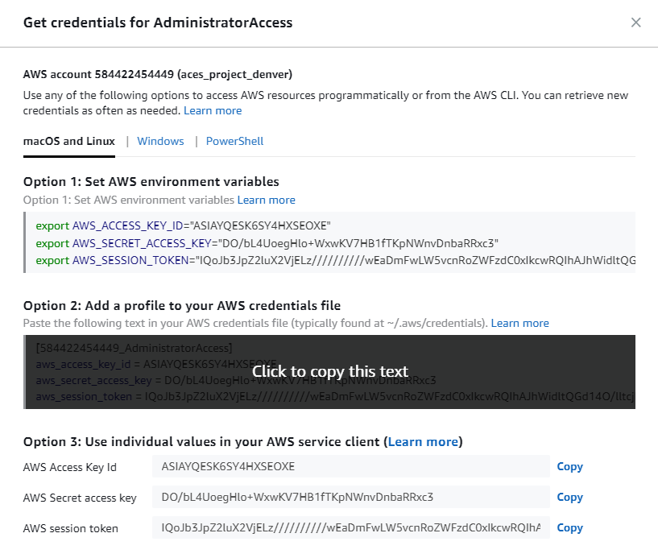
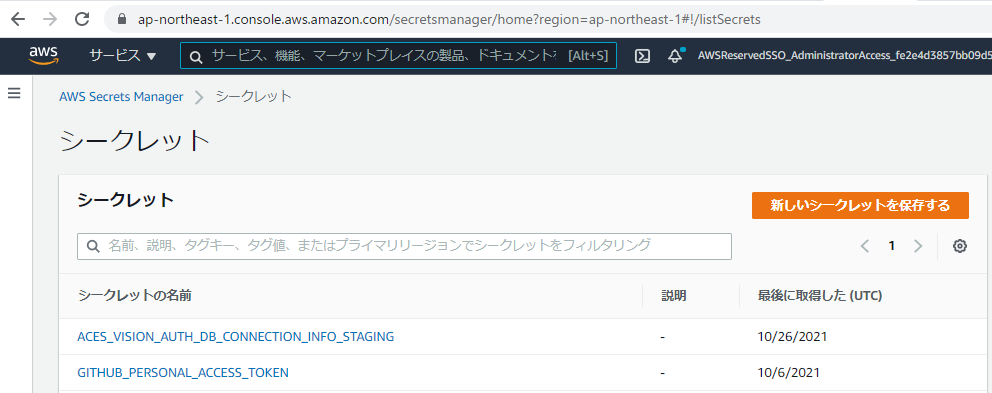

# 推論アルゴリズムサーバのinfra環境構築  <!-- omit in toc -->

この作業で[System diagram](https://aces.kibe.la/notes/19300#vpcsubnettransit-gateway%E8%A8%AD%E8%A8%88)を構成するUser Services内の各サービスの以下のネットワークリソースが作成されます
 - vpc
 - subnet
 - route table
 - transit gateway attachment
 - vpc endpoint

アルゴリズムサーバのインフラの構築はInfrastructureAsCode記述言語の「cdk」で行います
(今後もterraformだけで行くのは限界があるので、新しい技術を取り入れてより幅広くインフラテンプレートを書けるようInfrastructureAsCodeのトレンドにキャッチアップしています)

## 目次  <!-- omit in toc -->
- [1. 作業環境の構築](#1-作業環境の構築)
  - [1.1. 設定する環境変数の説明](#11-設定する環境変数の説明)
  - [1.2. 作業環境のsetup(install cdk)](#12-作業環境のsetupinstall-cdk)
    - [Install or update the AWS CDK CLI from npm](#install-or-update-the-aws-cdk-cli-from-npm)
  - [1.3. AWSアカウントでの準備](#13-awsアカウントでの準備)
- [2. アルゴリズムサーバのインフラ構築](#2-アルゴリズムサーバのインフラ構築)
  - [2.1. infra configファイルの作成](#21-infra-configファイルの作成)
  - [2.2. インフラ構築作業ディレクトリへ移動](#22-インフラ構築作業ディレクトリへ移動)
  - [2.3. Install packages](#23-install-packages)
  - [2.4. Set Env Value](#24-set-env-value)
  - [2.5. CDK Deploy](#25-cdk-deploy)
- [3. ドメイン解決の設定](#3-ドメイン解決の設定)
  - [3.1. 構築した環境(VPC)のvpc-idを取得](#31-構築した環境vpcのvpc-idを取得)
  - [3.2. ドメイン解決の実行](#32-ドメイン解決の実行)
    - [ACES Platform(dev)に接続する場合](#aces-platformdevに接続する場合)
    - [ACES Platform(staging)に接続する場合](#aces-platformstagingに接続する場合)
    - [ACES Platform(production)に接続する場合](#aces-platformproductionに接続する場合)
- [4. その他の運用](#4-その他の運用)
  - [4.1. 構築した環境の削除](#41-構築した環境の削除)
    - [4.1.1. アルゴリズムサーバの削除](#411-アルゴリズムサーバの削除)
    - [4.1.2. CDK事前準備](#412-cdk事前準備)
    - [4.1.3. CDK Destroy](#413-cdk-destroy)

## 1. 作業環境の構築
### 1.1. 設定する環境変数の説明

- Env: ACES Platform環境名 (dev, staging, production)
  - production: 正式に顧客にAPI提供する環境
  - dev: 社内開発時はdev環境を使用します
  - staging: productionへリリースする前の確認環境(大規模開発でversion管理が必要になったり、QAテスト等を必要としない限り考慮しなくてよい環境です)
- Project: プロジェクト名 (`project-`のprefixを基本的に使う。`project-`以降は任意の名前でよいです)
- AWS_PROFILE: AWSへアクセスするProfile名

作業時は毎回以下の通りAWSのcredentialを取得してAWS_PROFILEとして設定する必要があります
(`$ aws configure`のコマンドからprofileの設定はできません)

<p align="center">

</p>



```
# Copy commands in `Option 2` and paste credentials to ~/.aws/credentials.
[ここにAWS_PROFILE名をセット]
aws_access_key_id=
aws_secret_access_key=
aws_session_token=
```

### 1.2. 作業環境のsetup(install cdk)

作業はpoetryで仮想環境を作って作業するので、コンテナ内で行う必要はなくHostで直接作業します。
一度この作業環境を作成していればこのStepは不要です。

 - Python >= 3.8
 - Poetry がInstallされていること ([Poetry インストール手順](https://aces.kibe.la/notes/3342#poetry-%E3%81%AE%E3%82%A4%E3%83%B3%E3%82%B9%E3%83%88%E3%83%BC%E3%83%AB))
 - Node.js ≥ 8.11.x

#### Install or update the AWS CDK CLI from npm
```bash
npm i -g aws-cdk
```

version確認(v2.50.0以降が入っていればOK)
```bash
$ cdk --version
2.50.0 (build e0d3e62)
```

### 1.3. AWSアカウントでの準備

新規にProject用に作成されたAWSアカウントの場合に初回一度だけ行う設定です(既にAWSアカウントで一度行っていれば不要)
ACESアカウント(dev環境)は既に設定されていますので次のStepに進んでください。
作業でつまったらインフラ担当者にすぐ聞いて大丈夫です。簡単な作業ですがインフラ担当者と事前に話して作業をやってもらっても良いと思います。

 - AWS ConsoleでSecrets Managerにて以下の値を設定(AWS ACESアカウントのSecret Managerに登録されているGITHUB_PERSONAL_ACCESS_TOKENと同じ値を設定)
  GITHUB_PERSONAL_ACCESS_TOKEN

※Secrets Managerはtoken等セキュアな値をAWSに格納して管理する仕組み。AWSアカウントからgithubのソースコード取得で使用します。

 - AWS CodeBuildのgithub credentailの設定(コマンド実行)
```
export AWS_PROFILE=<TARGET_PROFILE>
aws codebuild import-source-credentials \
 --server-type GITHUB \
 --auth-type PERSONAL_ACCESS_TOKEN \
 --token <ここは上記で取得した値と同じ値を設定> \
 --region ap-northeast-1 \
 --profile ${AWS_PROFILE}
```

- AWS ConsoleでECSの画面のリポジトリから以下のECRリポジトリを作成する
   - $Project-$ENV-algorithm

- AWS Consoleから以下のS3 Bucketを作成する
   - $Project-$ENV
   - $Project-$ENV-batch-trigger

- AWS Consoleから作成したS3 Bucketのアクセス許可タブからオブジェクト所有者をACL無効に変更し、さらに下のCross-Origin Resource Sharing (CORS)を以下の設定にする。
```
[
    {
        "AllowedHeaders": [
            "*"
        ],
        "AllowedMethods": [
            "GET", "PUT"
        ],
        "AllowedOrigins": [
            "*"
        ],
        "MaxAgeSeconds": 3000
    }
]
```

## 2. アルゴリズムサーバのインフラ構築

### 2.1. infra configファイルの作成
`server/infra/configs/$Project-$Env-algorithm-server-infra.yml`
AWSアカウントIDやAWS上のIPアドレス空間(CIDR)の決定が必要になりますのでconfigファイルをインフラ担当者に作成してもらってください
※ 依頼する際にインフラ担当者にprojectで使用するgithubのリポジトリ名と、顧客へAPIを正式提供する環境を構築する場合はAWSアカウント名をあわせて伝えてください

### 2.2. インフラ構築作業ディレクトリへ移動
```bash
cd server/infra/initial_setup
```

### 2.3. Install packages
cdk作業仮想環境を作成し、築時に必要となるpackageをインストールします
```bash
poetry install --no-root
```

### 2.4. Set Env Value
仮想環境に入り環境変数を設定します
```bash
poetry shell
# aws sso login --profile <sso>
export AWS_PROFILE=<TARGET_PROFILE>
export Project=<Project name>
export REGION=ap-northeast-1
export Env=<Env>
```

### 2.5. CDK Deploy
アルゴリズムサーバのインフラをAWS上に構築します

```bash
# S3/ECRの作成 (ECRはAWS上のDockerImageを格納するリポジトリでアルゴリズム推論コンテナイメージを格納します)
cdk deploy ${Project}-${Env}-algorithm-store-${REGION} --profile ${AWS_PROFILE} --region ${REGION}
# VPCネットワークの構築
cdk deploy ${Project}-${Env}-algorithm-server-infra-${REGION} --profile ${AWS_PROFILE} --region ${REGION}
# AWS Batchコンピュータリソースの作成
cdk deploy ${Project}-${Env}-algorithm-compute-resource-${REGION} --profile ${AWS_PROFILE} --region ${REGION}
# アルゴリズムサービス部分の構築(AWS BatchやSagemakerのIAM Role等)
cdk deploy ${Project}-${Env}-algorithm-service-${REGION} --profile ${AWS_PROFILE} --region ${REGION}

```

## 3. ドメイン解決の設定

構築した環境(VPC)からACES Platform shared services のドメイン解決ができるようにします。

(参考リンク) [Route 53 のプライベートホストゾーンを別の AWS アカウントまたはリージョンの VPC に関連付けるにはどうすればよいですか?](https://aws.amazon.com/jp/premiumsupport/knowledge-center/private-hosted-zone-different-account/)

### 3.1. 構築した環境(VPC)のvpc-idを取得
```
aws ssm get-parameter --name /${Env}/${Project}/vpc-id --region ap-northeast-1 --profile ${AWS_PROFILE}
```
Valueの値をメモ

### 3.2. ドメイン解決の実行

#### ACES Platform(dev)に接続する場合
この設定はAWS_PROFILEはAWSアカウント'ACES'につながるAWS_PROFILEを使用して設定を行います
```
aws route53 create-vpc-association-authorization \
  --hosted-zone-id Z01071141WW60DUCZDB4U \
  --vpc VPCRegion=ap-northeast-1,VPCId=<メモしたvpc-id> \
  --profile ${AWS_PROFILE}
```

この設定は各Project側で実施します
```
aws route53 associate-vpc-with-hosted-zone \
  --hosted-zone-id Z01071141WW60DUCZDB4U \
  --vpc VPCRegion=ap-northeast-1,VPCId=<メモしたvpc-id> \
  --profile ${AWS_PROFILE}
```

#### ACES Platform(staging)に接続する場合
この設定はAWS_PROFILEはAWSアカウント'aces_service_aces_platform_staging'につながるAWS_PROFILEを使用して設定を行います
※ サーバ担当者にvpc-idを教えて設定してもらってください
```
aws route53 create-vpc-association-authorization \
  --hosted-zone-id Z0172116O1AO08F4AZ6X \
  --vpc VPCRegion=ap-northeast-1,VPCId=<メモしたvpc-id> \
  --profile ${AWS_PROFILE}
```

この設定は各Project側で実施します
```
aws route53 associate-vpc-with-hosted-zone \
  --hosted-zone-id Z0172116O1AO08F4AZ6X \
  --vpc VPCRegion=ap-northeast-1,VPCId=<メモしたvpc-id> \
  --profile ${AWS_PROFILE}
```

#### ACES Platform(production)に接続する場合
この設定はAWS_PROFILEはAWSアカウント'aces_service_aces_platform_production'につながるAWS_PROFILEを使用して設定を行います
※ サーバ担当者にvpc-idを教えて設定してもらってください
```
aws route53 create-vpc-association-authorization \
  --hosted-zone-id Z03857753ADXO7NNGODT0 \
  --vpc VPCRegion=ap-northeast-1,VPCId=<メモしたvpc-id> \
  --profile ${AWS_PROFILE}
```

この設定は各Project側で実施します
```
aws route53 associate-vpc-with-hosted-zone \
  --hosted-zone-id Z03857753ADXO7NNGODT0 \
  --vpc VPCRegion=ap-northeast-1,VPCId=<メモしたvpc-id> \
  --profile ${AWS_PROFILE}
```

## 4. その他の運用

### 4.1. 構築した環境の削除

お試しで建てただけで使わなくなった環境やサービス終了で不要になった環境を削除する手順です。

#### 4.1.1. アルゴリズムサーバの削除
[4.2. アルゴリズムサーバの使用後の停止](https://aces.kibe.la/notes/15646#42-%E3%82%A2%E3%83%AB%E3%82%B4%E3%83%AA%E3%82%BA%E3%83%A0%E3%82%B5%E3%83%BC%E3%83%90%E3%81%AE%E4%BD%BF%E7%94%A8%E5%BE%8C%E3%81%AE%E5%81%9C%E6%AD%A2)の手順を行います。

#### 4.1.2. CDK事前準備
[1. 作業環境の構築](#1-作業環境の構築)の手順を行いAWSへアクセスするcredentialを取得します。
続いて、[2. アルゴリズムサーバのインフラ構築](#2-アルゴリズムサーバのインフラ構築)の「2.5. CDK Deploy」の直前まで実施して、cdkの実行環境を整えます。

#### 4.1.3. CDK Destroy
アルゴリズムサーバのインフラをAWS上から削除します
(「4.1.1. アルゴリズムサーバの削除」でアルゴリズムサーバが削除されていないとエラーになります)

```bash
# アルゴリズムサービス部分の削除
cdk destroy ${Project}-${Env}-algorithm-service-${REGION} --profile ${AWS_PROFILE} --region ${REGION}
# AWS Batchコンピュータリソースの削除
cdk destroy ${Project}-${Env}-algorithm-compute-resource-${REGION} --profile ${AWS_PROFILE} --region ${REGION}
# VPCネットワークの削除
cdk destroy ${Project}-${Env}-algorithm-server-infra-${REGION} --profile ${AWS_PROFILE} --region ${REGION}

# ローカルPCのコンテキスト情報の削除
cdk context --clear
```
